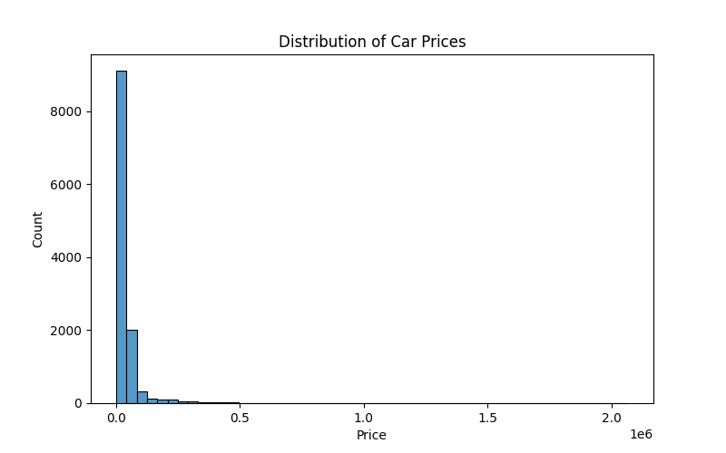
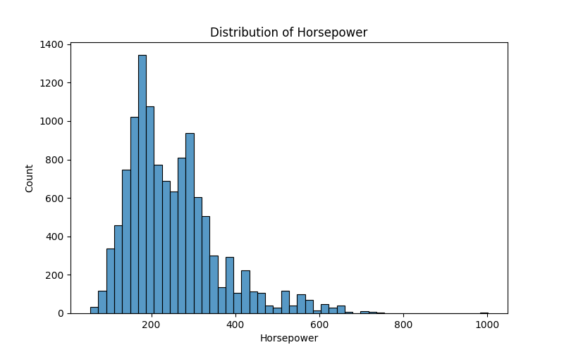
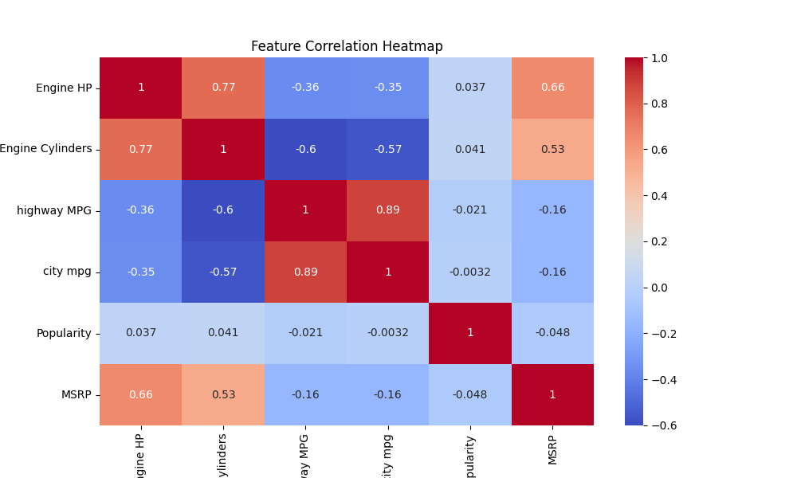
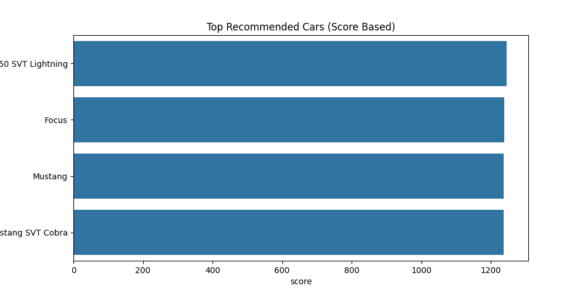

# Car Recommendation Engine

Machine learning–based recommendation system that suggests vehicles based on similarity modeling, user preference filtering, and weighted ranking logic.

Live Demo: https://car-recommendation-engine-n7mwvkhqqnl2sxuw4wzncs.streamlit.app

---

## Overview

This project builds an intelligent car recommendation system using real-world automotive data.  
The system allows users to discover vehicles based on similarity to existing cars, as well as personalized constraints such as budget, horsepower, and fuel efficiency.

The goal of this project is to demonstrate the design of a practical recommender system pipeline including data preprocessing, feature scaling, similarity modeling, ranking heuristics, and interactive user input handling.

## Web App

This project includes an interactive Streamlit interface for generating car recommendations.

Run locally:

```bash
streamlit run app/streamlit_app.py
```
---

## Tech Stack

- Python  
- Pandas — data cleaning and feature engineering  
- NumPy — numerical operations  
- Scikit-learn — KNN similarity model and feature scaling  
- Matplotlib — visualization  
- Seaborn — statistical visualization  
- Joblib — model artifact persistence  
- Jupyter Notebook — experimentation and pipeline development  

---

## Dataset

Automotive dataset containing **11,900+ vehicles** with attributes such as:

- Make and Model  
- Engine Horsepower  
- Engine Cylinders  
- Transmission Type  
- Vehicle Size and Style  
- Highway and City MPG  
- Popularity Score  
- MSRP (vehicle price)

Dataset is included in the `data/` folder.

---

## Project Structure

* data/ → raw automotive dataset
* notebooks/ → recommender system notebook
* images/ → saved visualizations
* model/ → saved scaler and cleaned dataset artifacts
* requirements.txt → project dependencies
* README.md → project documentation

---

## Methodology

### Data Preprocessing

- Handling missing values using median and mode imputation  
- Feature selection for similarity modeling  
- Numerical feature scaling using StandardScaler  

### Similarity Recommendation Model

- Built using **K-Nearest Neighbors (KNN)**  
- Euclidean distance used to identify similar vehicles  
- Allows recommendation based on an existing vehicle selection  

### User Preference Filtering

System enables filtering based on:

- Maximum budget  
- Minimum horsepower  
- Minimum fuel efficiency  

This simulates real-world decision constraints in vehicle selection.

### Weighted Ranking System

A custom scoring function ranks cars using normalized feature weights:

- Fuel efficiency importance  
- Engine performance importance  
- Popularity factor  
- Price optimization  

This prevents trivial recommendations (e.g., only cheapest vehicles) and produces balanced suggestions.

### Model Artifact Saving

- Scaler object saved using Joblib  
- Cleaned dataset snapshot saved for reuse  
- Enables future deployment in web applications or APIs  

---

## Results

The recommendation system successfully generates:

- Similar vehicle suggestions using feature-space proximity  
- Personalized recommendations using constraint filtering  
- Ranked vehicle outputs based on multi-factor scoring  

The system demonstrates how heuristic ranking combined with similarity modeling can produce practical recommendation pipelines.

---

## Key Insights

- Feature normalization is essential for distance-based models  
- Pure price-based sorting leads to unrealistic recommendations  
- Weighted ranking improves recommendation quality  
- MPG and horsepower show meaningful trade-off relationships  
- Popularity can act as a proxy for market acceptance  

---

## 📊 Visualizations

<h3 align="center">Price Distribution</h3>

<p align="center">
  
</p>

<h3 align="center">Horsepower Distribution</h3>

<p align="center">
  
</p>

<h3 align="center">Feature Correlation Heatmap</h3>

<p align="center">
  
</p>

<h3 align="center">Top Ranked Cars</h3>

<p align="center">
  
</p>

---

## Run Instructions

```bash
git clone https://github.com/Ironclad1738281/car-recommendation-engine.git
cd car-recommendation-engine
pip install -r requirements.txt
jupyter notebook
```
Open:

notebooks/car_recommender.ipynb

---

## Conclusion

This project demonstrates the construction of a practical recommendation system combining similarity modeling, constraint-based filtering, and heuristic ranking.
Such hybrid recommendation pipelines are widely used in e-commerce, mobility platforms, and product discovery systems.

## Future Improvements

* Collaborative filtering recommender models

* Gradient boosting–based ranking

* Real-time recommendation API

* Streamlit web interface

* User preference storage and personalization

* Deep learning–based recommendation embeddings

## Author

Naveenchandra Nallamothu
B.S. Computer Science — George Mason University